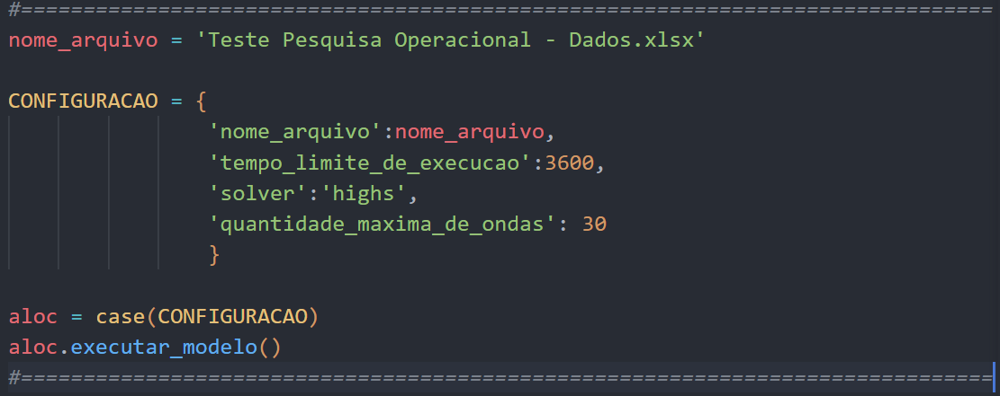

# Case pesquisa operacional
Este repositório contém a resolução do case.

## Premissas
O código desenvolvido consta no arquivo case.py

O modelo foi implementado utilizando os solvers Gurobi e Highs, podendo-se alternar o solver alterando a chave 'solver' no dicionário configuração que consta no arquivo case.py conforme print a seguir.

Para utilizar o solver highs, basta escrever highs na chave solver, já para utilizar o solver gurobi, basta escrever 'gurobi' na chave solver.

É possível também alterar a quantidade máxima de ondas como um parâmetro, alterando no dicionário. Também é possível alterar o tempo máximo em segundos que o solver tem disponível para encontrar soluções factíveis para o problema.

Também foi criado um dockerfile para criação de imagem docker que também está disponível no link:
https://hub.docker.com/r/rafaelgardel/case
## Conclusão

- Foi encontrada uma solução factível com gap igual a zero.
- A solução está na localizada no caminho: output\solucao_final.xlsx
- É possível utilizar tanto o Gurobi como o Highs para resolver o modelo.
- Na solução encontrada, foram necessárias 29 ondas de produção, os detalhes de quais caixas devem estar em quais ondas, assim como quais itens devem estar em quais ondas, constam nas abas Caixas por Onda e Itens por Onda, respectivamente.

## Pacotes Requeridos
- Listados no requirements.txt
